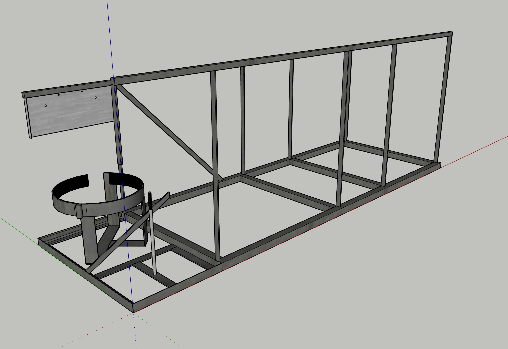
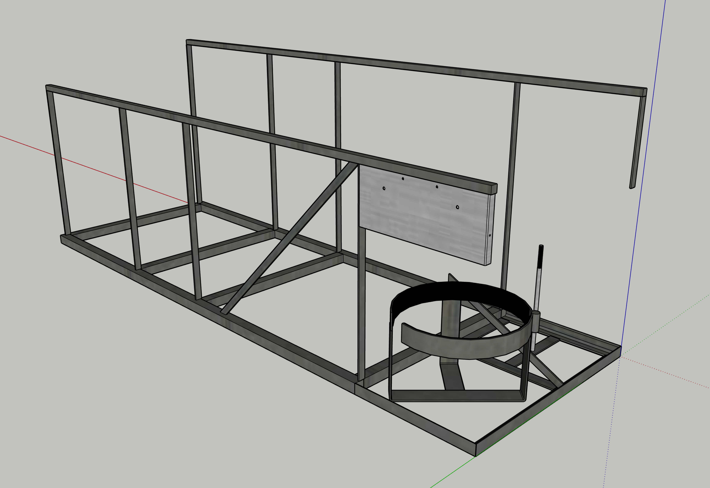

# P2 Camp Kitchen

A tow bar mounted camping kitchen.

--
## Index

1. [Overview](#overview)
2. [Notes](#notes)
3. [Abbreviations](#abbreviations)

## Docs

1. [Detail](docs/Detail.md) ([PDF](docs/Detail.pdf))
2. [Frame](docs/Frame.md) ([PDF](docs/Frame.pdf))
3. [Plywood](docs/Plywood.md) ([PDF](docs/Plywood.pdf))
4. Undercarriage
<!--4. [Undercarriage](docs/Undercarriage.md) ([PDF](docs/Undercarriage.pdf))-->
5. Components
<!--5. [Components](docs/Components.md) ([PDF](docs/Components.pdf))-->
6. Lights
<!--6. [Lights](docs/Lights.md) ([PDF](docs/Lights.pdf))-->
7. Sheet-Metal
<!--7. [Sheet-Metal](docs/Sheet-Metal.md) ([PDF](docs/Sheet-Metal.pdf))-->
8. Steel
<!--8. [Steel](docs/Steel.md) ([PDF](docs/Steel.pdf))-->
9. Assemblies
<!--9. [Assemblies](docs/Assemblies.md) ([PDF](docs/Assemblies.pdf))-->

## Overview

## *Notes*

“Front”, “Back”, “Left”, & “Right” are from the viewpoint of facing the 1600 mm side that is the kitchen front when deployed & to the front when stowed. That makes “left” & “right” opposite to car driver’s seat viewpoint.

## Abbreviations

To be concise a number of arbitrary abbreviations are used. These are all defined here.

<dl>
	<dt>LH</dt><dd>Left Hand</dd>
	<dt>LF</dt><dd>Left hand Front</dd>
	<dt>LB</dt><dd>Left hand Back</dd>
	<dt>RH</dt><dd>Right Hand</dd>
	<dt>RF</dt><dd>Right hand Front</dd>
	<dt>RB</dt><dd>Right hand Back</dd>
	<dt>D</dt><dd>Drawer</dd>
	<dt>Dn</dt><dd>Drawer 1 to 5</dd>
</dl>

