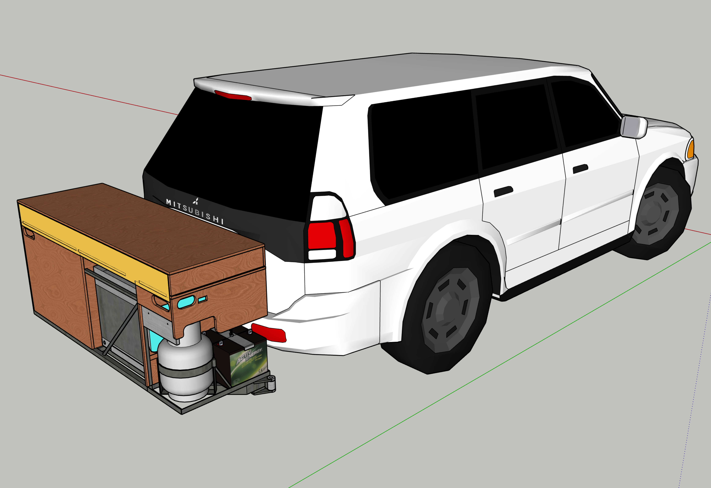

# P2 Camp Kitchen

A tow bar mounted camping kitchen.

--

1. [Frame](docs/_PDF/Frame.md) ([PDF](docs/Frame.pdf))
1. [Plywood](docs/_PDF/Plywood.md) ([PDF](docs/Plywood.pdf))
1. Assemblies
<!--1. [Assemblies](docs/_PDF/Assemblies.md) ([PDF](docs/Assemblies.pdf))-->
1. Components
<!--1. [Components](docs/_PDF/Components.md) ([PDF](docs/Components.pdf))-->
1. Detail
<!--1. [Detail](docs/_PDF/Detail.md) ([PDF](docs/Detail.pdf))-->
1. Lights
<!--1. [Lights](docs/_PDF/Lights.md) ([PDF](docs/Lights.pdf))-->
1. Overview
<!--1. [Overview](docs/_PDF/Overview.md) ([PDF](docs/Overview.pdf))-->
1. Sheet Metal
<!--1. [Sheet Metal](docs/_PDF/Sheet-Metal.md) ([PDF](docs/Sheet-Metal.pdf))-->
1. Steel
<!--1. [Steel](docs/_PDF/Steel.md) ([PDF](docs/Steel.pdf))-->
1. Undercarriage
<!--1. [Undercarriage](docs/_PDF/Undercarriage.md) ([PDF](docs/Undercarriage.pdf))-->

## *Note*

“Front”, “Back”, “Left”, & “Right” are from the viewpoint of facing the 1600 mm side that is the kitchen front when deployed & to the front when stowed. That makes “left” & “right” opposite to car driver’s seat viewpoint.

## Abbreviations

* **D** - Drawer
* **Dn** - Drawer 1 to 5
* **LH** - Left Hand
* **LB** - Left hand Back
* **LF** - Left hand Front
* **RH** - Right Hand
* **RB** - Right hand Back
* **RF** - Right hand Front

