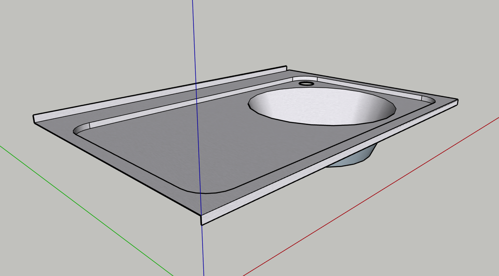
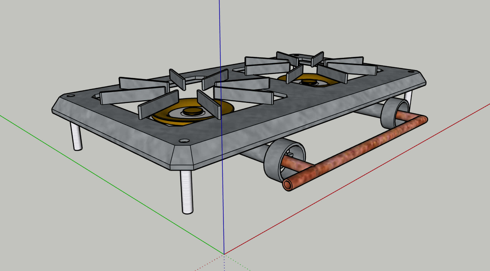
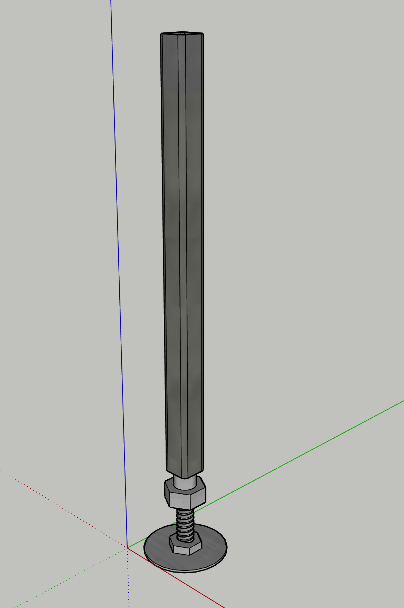
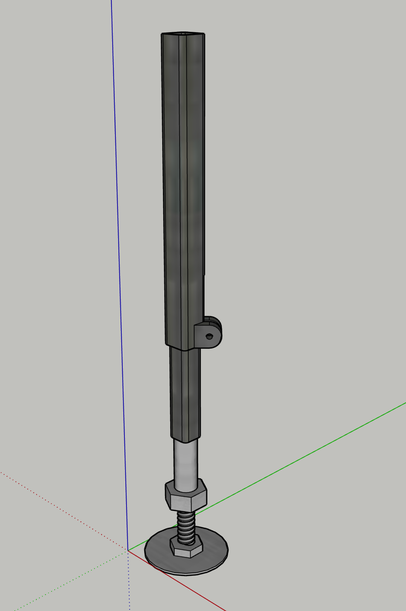
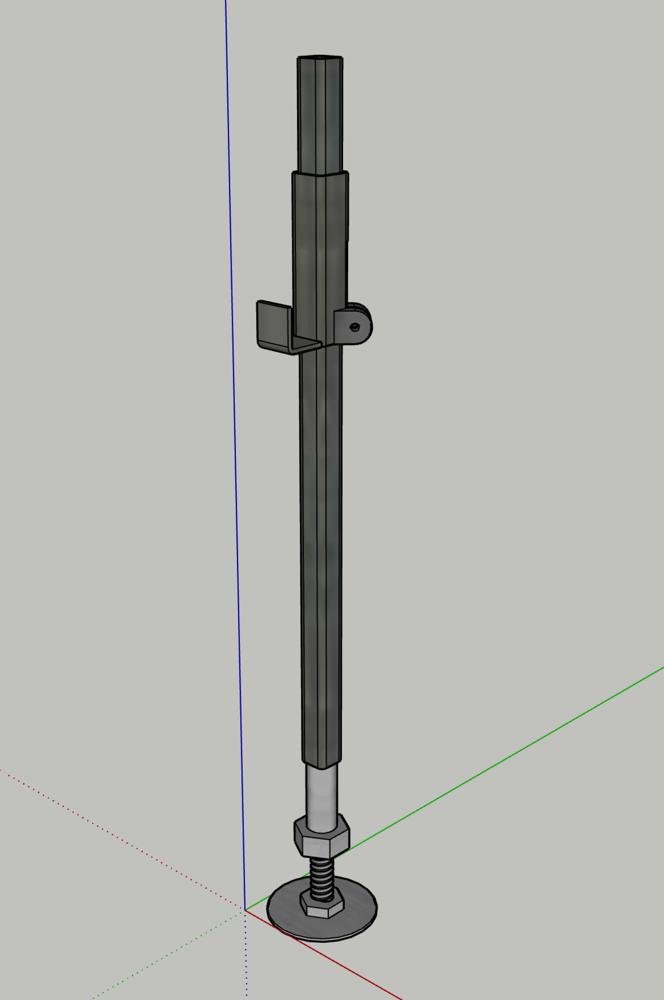
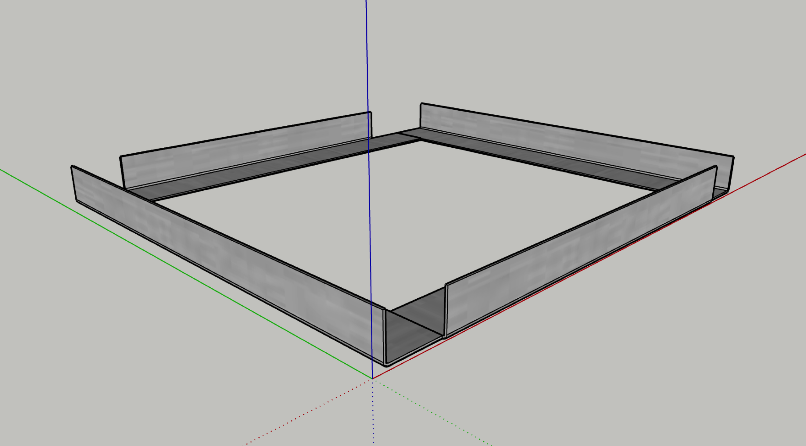
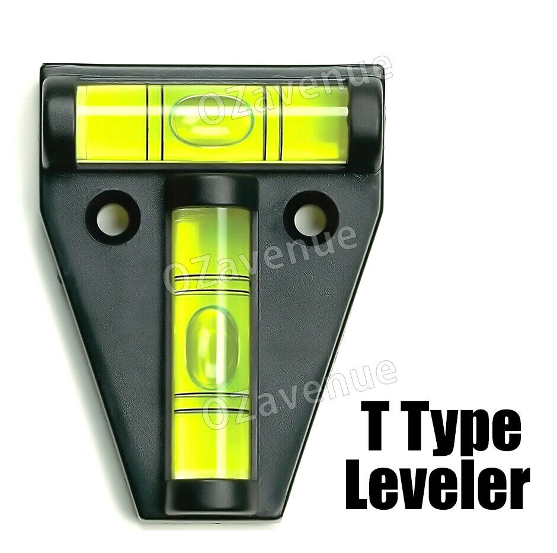
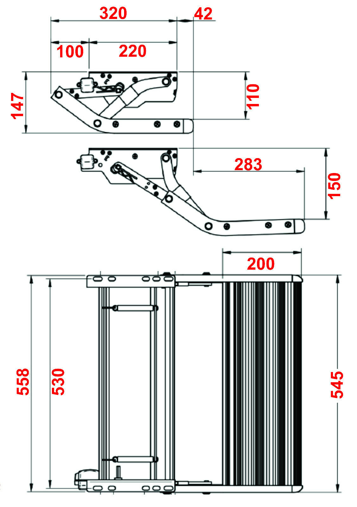
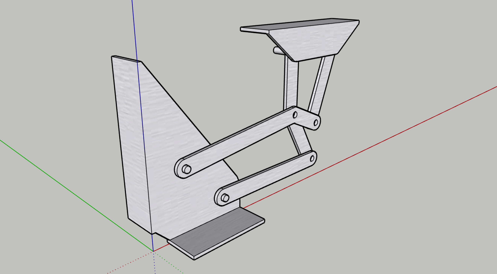
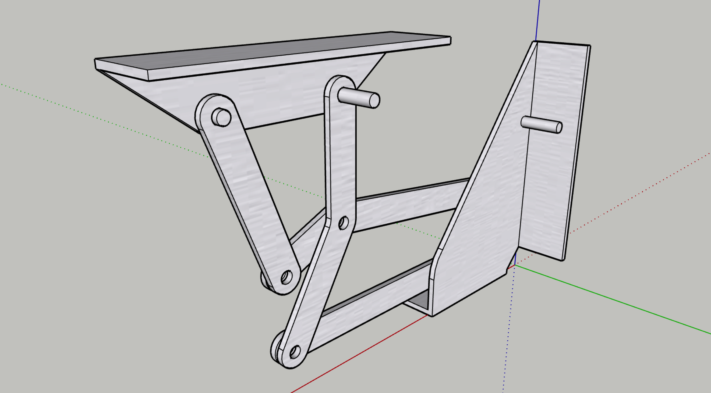

# Components

1. [Sink](#01)
2. [Stove](#02)
3. [Gas Bottle Holder](#03)
4. [Legs](#04)
5. [Fridge Tray](#05)
6. [Caravan Level](#06)
7. [Caravan Step](#07)
8. [Lid Hinge](#08)

--

##  Sink

Drawing is model of 2nd hand caravan sink. Has a mixer tap fitted.

##  Stove

The stove has cast iron legs attached at the corners with bolts. By replacing the original legs with spacers (standoffs, angle, 15x15 RHS), & using longer bolts, the stove can be solidly attached to the benchtop.

##  Gas Bottle Holder

* [eBay purchase](https://www.ebay.com.au/itm/254621457008)
* To be modified to sit at approximately 45 degrees within the energy subframe.

##  Legs

* The box should have 2 or 3 adjustable legs to support it in a level position in camp.
* The legs could either be permanently attached on pivots & swing down at camp setup, or be inserted into sockets at camp setup.
* Having a jockey wheel on one leg may be useful to provide support during camp setup.

Two possible versions are drawn…

Version 1, with screw adjustment only.

Version 2, with slide & screw adjustment.

Version 3, with hook mount & screw adjustment.

##  Fridge Tray

* A rudimentay 'tray' to support the fridge between drawer rails.
* Vertical portions of the sides must be deep enough for attachment of drawer rails.
* The pilot light hole at the bottom RB corner of the fridge must remain unobstructed.
* The drawing uses 4 pieces of angle as described in the Sheet Metal file.

##  Caravan Level

* [eBay purchase](https://www.ebay.com.au/itm/125243519326)
* To be mounted on benchtop as an aid to levelling at camp setup.

##  Caravan Step

* [eBay purchase](https://www.ebay.com.au/itm/293101007284)
* To be fitted underneath Base.
* Selected item has lighting to be part of safety lighting.

##  Lid Hinge

Custom hinge to provide a right opening action for the lid.

