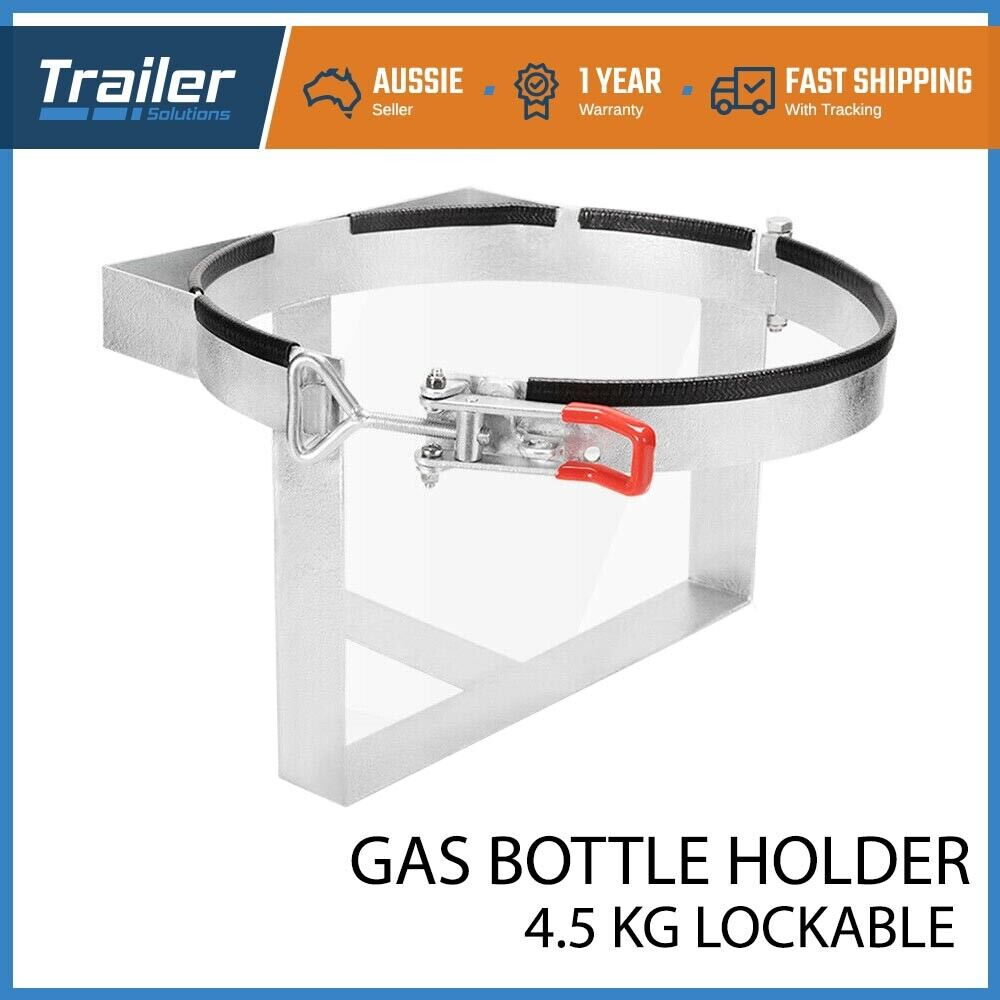

# Components

## Sink

Drawing is model of 2nd hand caravan sink. Has a mixer tap fitted.

## Stove

## Fridge Tray

--

## Caraval level

[eBay purchase](https://www.ebay.com.au/itm/125243519326)

To be mounted on benchtop.

## Gas bottle holder

[eBay purchase](https://www.ebay.com.au/itm/254621457008)

Will be modified to sit at approximately 45 degrees, & Energy Rack.

## Caravan step

[eBay purchase](https://www.ebay.com.au/itm/293101007284)

Will be fitted underneath Base. Selected item has lighting to be part of safety lighting.

## Legs

