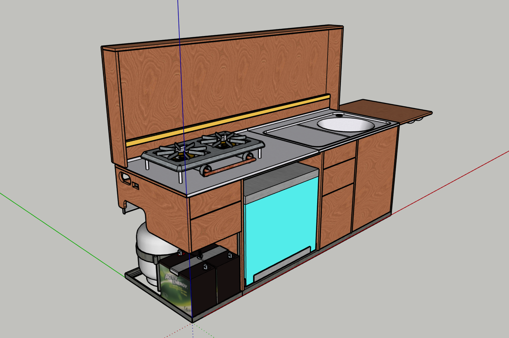

# Detail

1. [Front & Back Views](#01)
2. [Left & Right Views With Lid Open](#02)
3. [Closer Views of Lid Closed & Lid Open](#03)
4. [Superimposed Lid Positions](#04)
5. [Stove Detail](#05)
6. [Sink Detail](#06)
7. [Front & Back Views of Energy Subframe](#07)

--

##  Front & Back Views

##  Left & Right Views With Lid Open

##  Closer Views of Lid Closed & Lid Open

##  Superimposed Lid Positions

##  Stove Detail

##  Sink Detail

##  Front & Back Views of Energy Subframe

