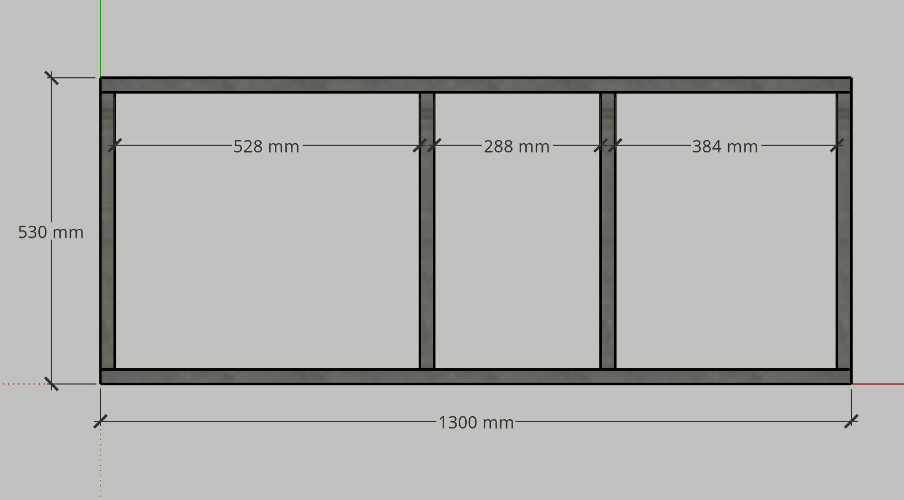
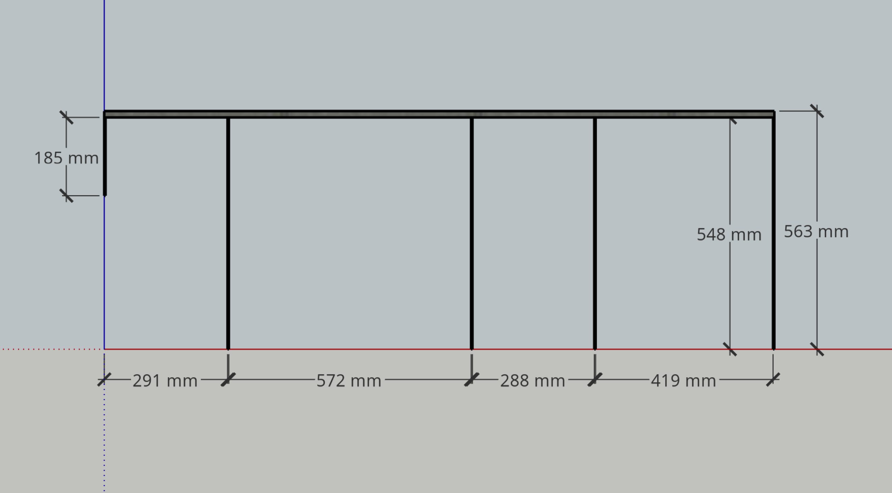
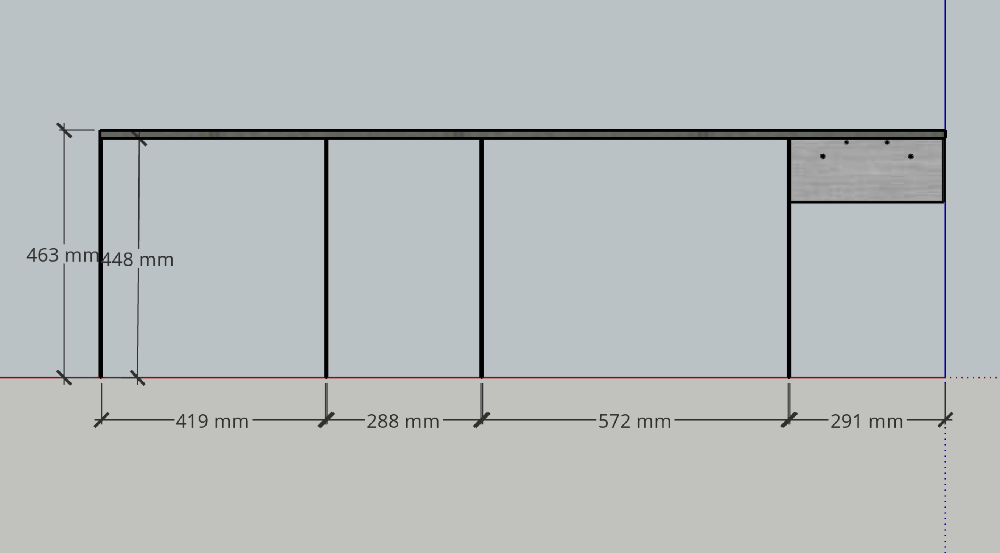
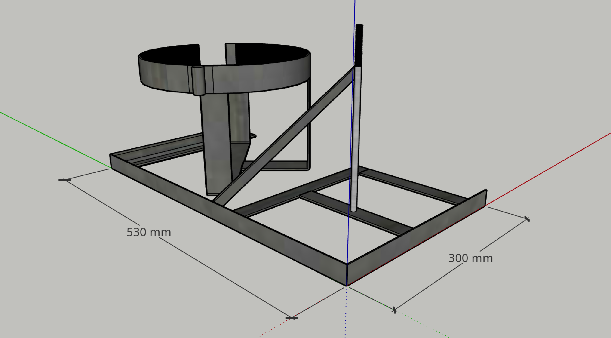
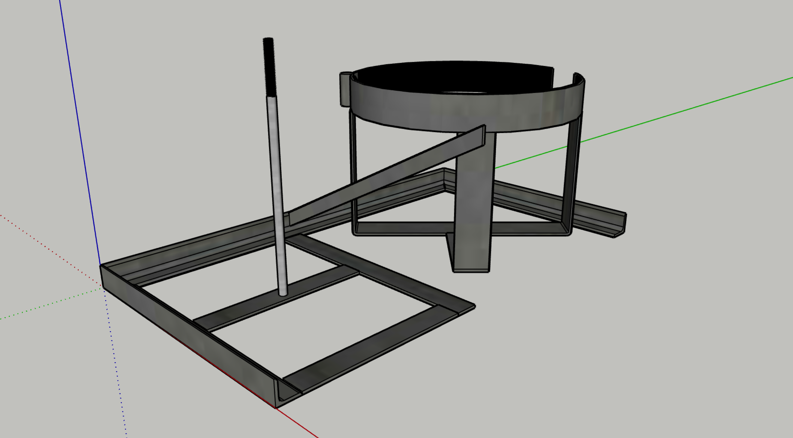
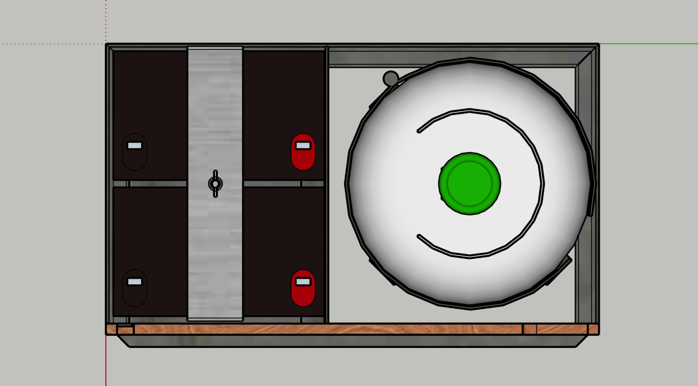
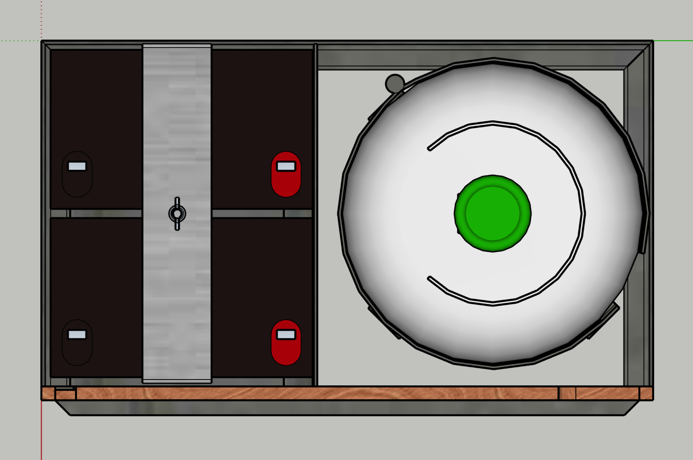
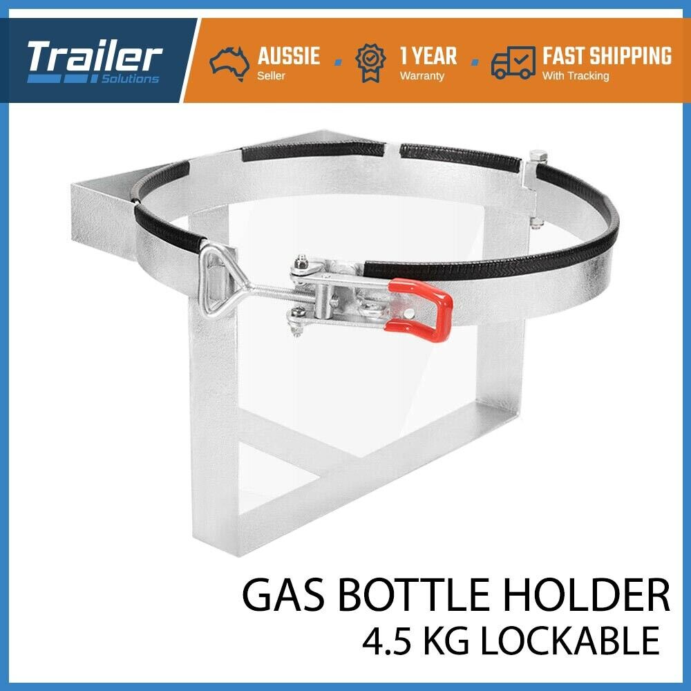

# Frame

Rectangular hollow, 25 x 25 mm angle, & 16 x 3 mm flat bar, steel.

## Bottom Frame

All 25x25 RHS. Bottom rails, 1300 mm long, spaced 475 mm apart with cross members as shown. Drawn with mitred end joins but don’t have to be joined that way. Butt joins would make a cutting list of just 2 x 25x25 RHS 1300 mm long, & 4 x 25x25 RHS 480 mm long.

A mount for a reversing light might be required. That is drawn as 23x3 flat, 30 mm long, with an 8 mm hole in the centre. The hole could be further inside the frame.

## Front & Back Frames

The front & back frames are mirror images of each other with 3 differences…

* The front frame is 100 mm taller,
* The front frame has an additional vertical member at the LH end.
* The back frame has a number plate mount attached.

Both frames…

* Have top members of 15x15 RHS 1582 long.
* Assembled flush to the outside face.
* Have vertical members of 16x3 flat attached as shown.

Vertical members are 548 mm for the front frame & 448 mm for the back frame, for overall heights of 563 mm & 463 mm.

Numbering the vertical members 1 being the additional vertical on the front frame & 5 being the RH vertical, the spacing between 1 & 2 should be equal to the spacing between 3 & 4 (so that there is only one width of drawer).

The additional vertical on the front frame is 185 mm & attached under the LH end.

The number plate mount to be attached as shown, flush to the outside face with the return facing inward.

## Energy Subframe

A subframe to support gas bottle & batteries.

Three sides of a rectangle 530 mm (one side) x 300 mm (both sides), made of 25x25 angle, as shown.

Plan views of the energy subframe with horizontal & vertical betteries…

### Gas Bottle Holder

The gas bottle holder is an [eBay purchase](https://www.ebay.com.au/itm/254621457008). It will be modified to sit at approximately 45 degrees within the  Energy Subframe to permit opening without interference.

### Battery Holder

The battery holder as shown is for illustration only. It may be however the engineer chooses to achieve…

* Batteries positioned as close as practical to the inside face of the front angle.
* The first battery is positioned as close as practical to the inside face of the LH angle.
* The spaces between the batteries, & between the imaginary RH surface of the subframe, are approximately equal.
* The batteries are retained & kept in position by a simple, yet secure, means.

The diagonal brace shown is a possible way to maintain battery position in that direction while adding support to the structure.

## Assembly

The front & back frames are attached to the bottom frame…

* Flush to the LH end.
* 9 mm inboard of the RH end.
* 12 mm inboard of their respective faces.

There are 2 x cross members of 16 x 3 mm flat, & one cross member of 25 x 3 mm flat.

The 16 mm cross members are flush in the end planes of the top rails, running horizontally from the inside face of the back top rail to the adjacent front vertical.

The 25 mm cross member runs horizontally between the LH pair of verticals, at a height for attachment to the band of the gas bottle holder (with a spacer if appropriate).

The energy rack is attached to the LH end of the bottom frame.
