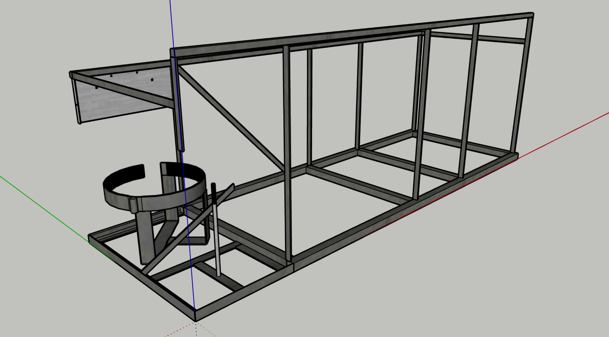
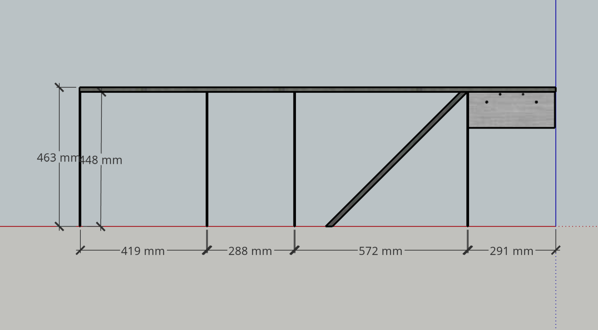
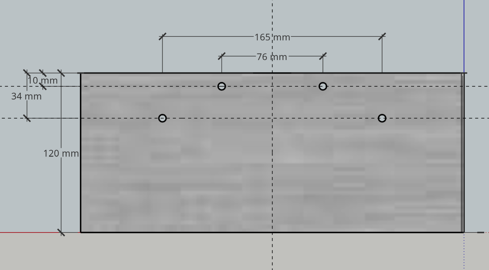
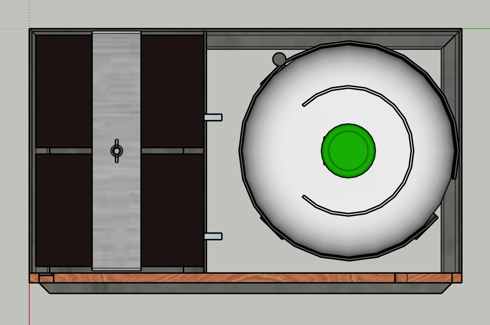

# Frame

1. [Overview](#01)
2. [Bottom Frame](#02)
3. [Front & Back Frames](#03)
4. [Energy Subframe](#04)
5. [Assembly](#05)

--

Made principally from…

* 25x25 mm RHS
* 15x15 mm RHS
* 16x3 mm flat steel
* 25x3 mm flat steel

##  Overview

##  Bottom Frame

* All 25x25 RHS.
* Bottom rails, 1300 mm long, spaced 480 mm apart.
* Cross members, 480 mm long, positioned as shown.

##  Front & Back Frames

The front & back frames are mirror images of each other with some differences.

* Top members of 15x15 RHS, 1582 long.
* Assembled flush to the outside face.
* Have vertical members of 16x3 flat attached as shown.

### Front Frame

* Vertical members are 548 mm for an overall height of 563 mm.
* Has an additional vertical member, 185 mm long, drawn attached *under* the LH end.
* That additional vertical member could be attached over the end by making appropriate adjustments to dimensions. It has been drawn attached under to minimise the number of items in a cutting list.

### Back Frame

* Vertical members are 448 mm for an overall height of 463 mm.
* Has a number plate mount attached as shown.
* Has a 45° diagonal brace as shown.

### Number Plate Mount

##  Energy Subframe

A subframe to support gas bottle & batteries.

Three sides of a rectangle 530 mm (one side) x 300 mm (both sides), made of 25x25 angle, as shown.

Plan views of the energy subframe with horizontal & vertical batteries…

### Gas Bottle Holder

* An [eBay purchase](https://www.ebay.com.au/itm/254621457008).
* To be modified to sit at approximately 45 degrees within the  Energy Subframe to permit opening without interference.
* Drawings show it positioned 3 mm inside the imagary back face, & centred left to right.

### Battery Holder

The battery holder as shown is for illustration only. It may be however the engineer chooses to achieve…

* Batteries positioned as close as practical to the inside face of the front angle.
* The first battery is positioned as close as practical to the inside face of the LH angle.
* The spaces between the batteries, & between the imaginary RH surface of the subframe, are approximately equal.
* The batteries are retained & kept in position by a simple, yet secure, means.

The diagonal brace shown is a possible way to maintain battery position in the back direction while adding support to the structure.

##  Assembly

The front & back frames are attached to the bottom frame…

* Flush to the LH end.
* 9 mm inboard of the RH end.
* 12 mm inboard of their respective faces.

There are 2 x cross members of 16 x 3 mm flat, & one cross member of 25 x 3 mm flat.

The 16 mm cross members are flush in the end planes of the top rails, running horizontally from the inside face of the back top rail to the adjacent front vertical.

The 25 mm cross member runs horizontally between the LH pair of verticals, at a height for attachment to the band of the gas bottle holder (with a spacer if necessary). The actual height must be advised for appliction to plywood cutting.

The energy rack is attached to the LH end of the bottom frame.

