# Plywood

Pieces cut from 12 mm marine ply.

## Cross Panels

Five cross members, LH, RH, & 1 to 3 numbered LH to RH.

Routing is 3mm deep & 18 mm wide for 16 x 3 mm flat steel to fit flush within.

**Panel LH:** 530 x 250 mm, with hole for water hoses & cutout for gas bottle access.

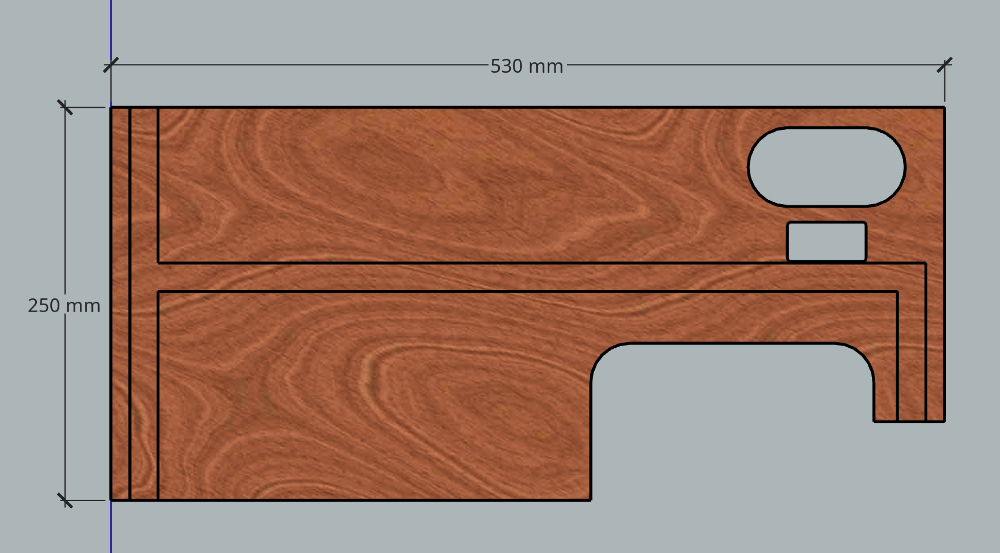

**Panel RH:** 530 x 563 mm.

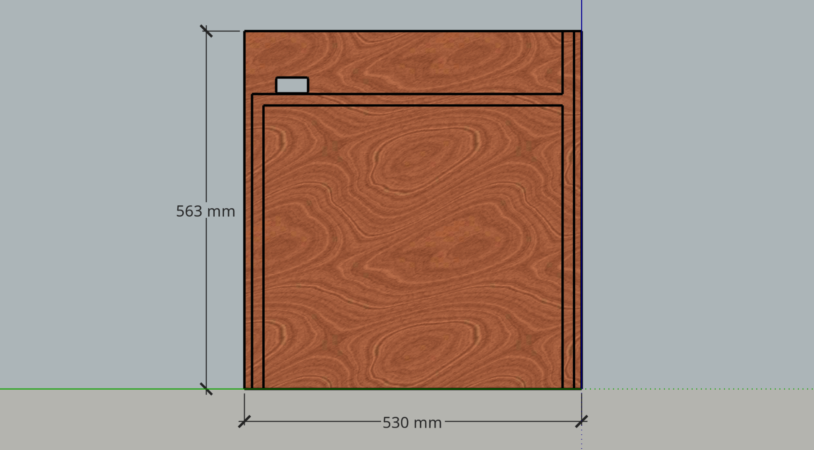

**Panel 1:** 530 x 563 mm, with hole for gas hose movement, & cutouts for frame top rails, pipe & wiring, & LH back panel. Horizontal routed channel is 27 mm for 25 x 3 mm flat steel.

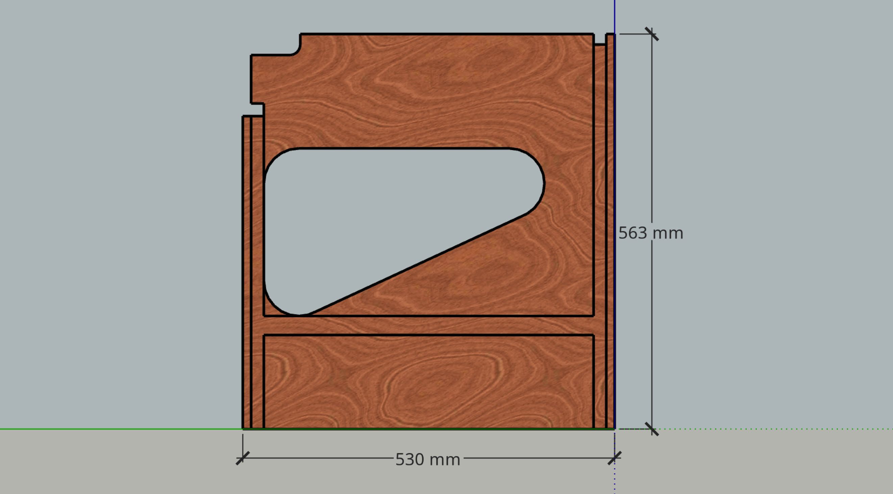

**Panel 2:** 518 x 563 mm, with cutouts for frame top rails, & pipe & wiring.

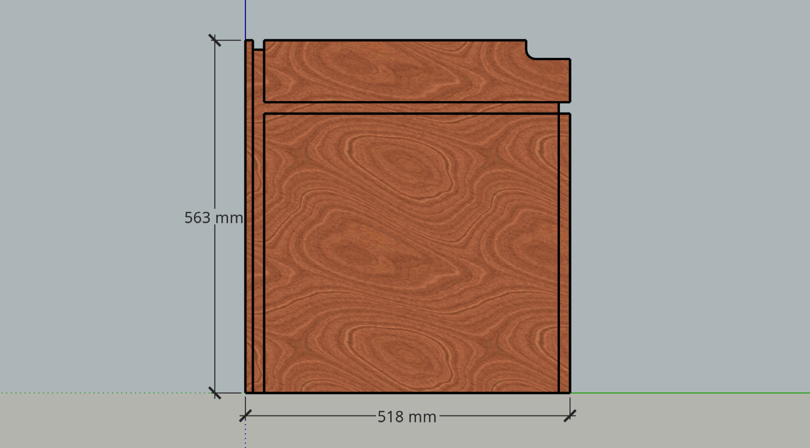

**Panel 3:** Mirror of panel 3.

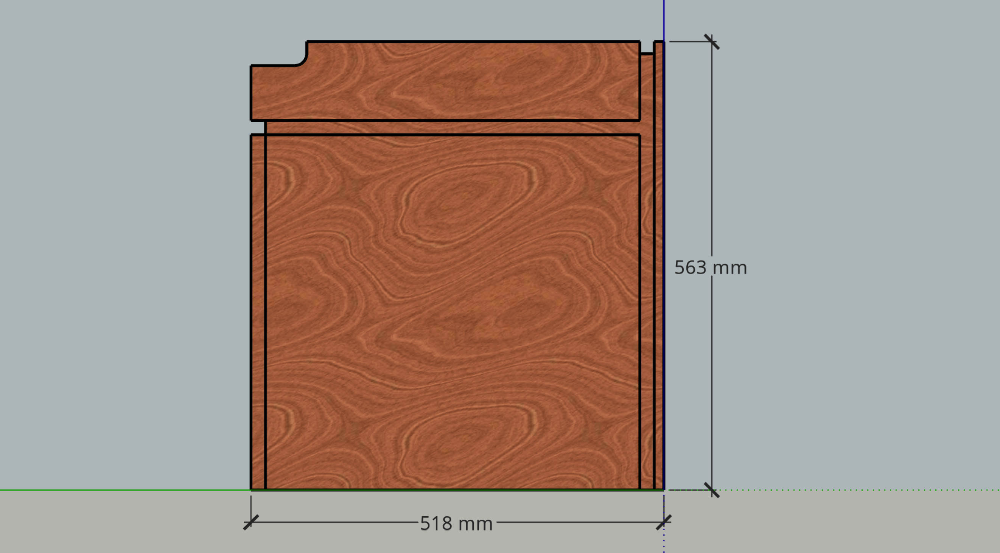

## Back Panels

Two back panels, both having holes for mounting taillights.

**LH Back Panel:** 300 x 115 mm, with routing so that number plate light can be recessed.

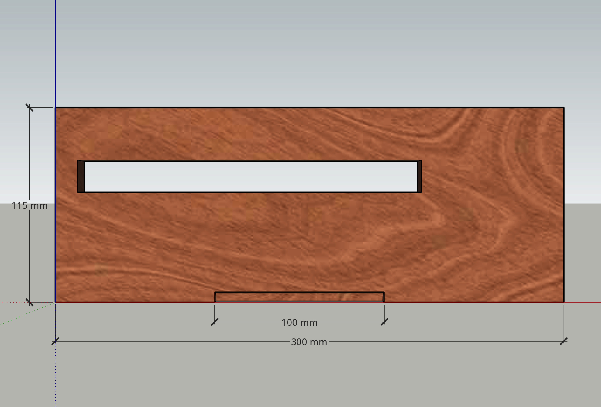

**RH Back Panel:** 722 x 563 mm.

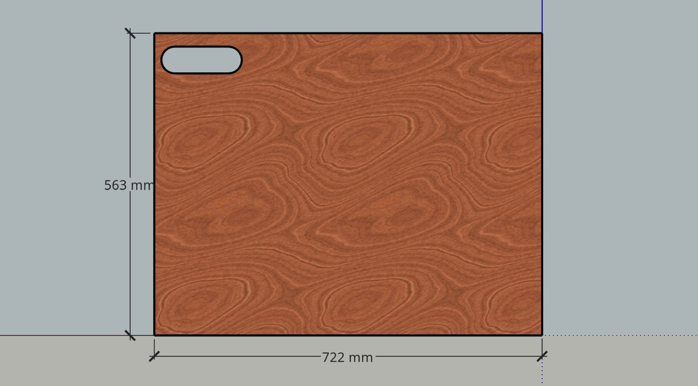

## Benchtop

1600 x 530 mm, with hole for sink & cutout for wiring to splash back.

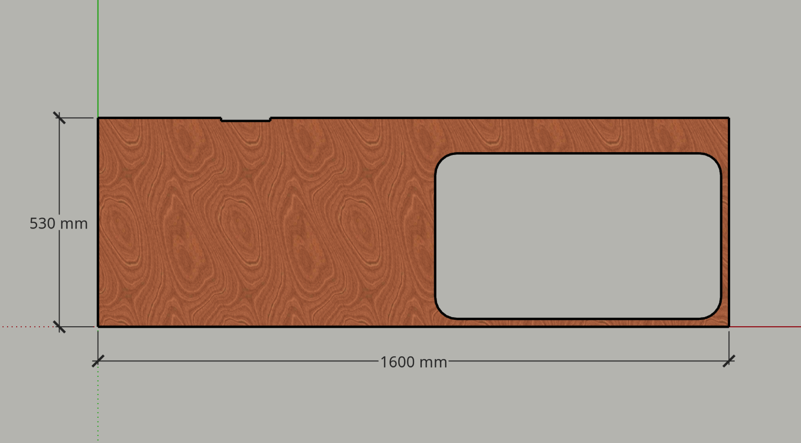

## Drawers

Five drawers with front panels…

Drawer fronts 1 & 3, 284 x 96 mm for a nominal depth of 100 mm.

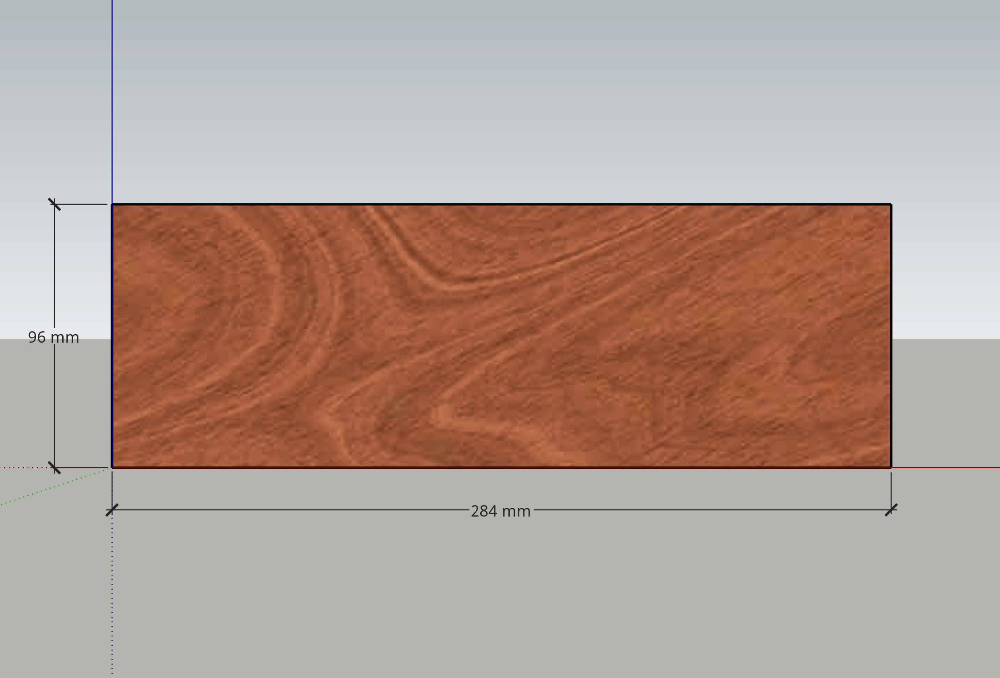

Drawer fronts 2 & 4, 284 x 146 mm for a nominal depth of 150 mm.

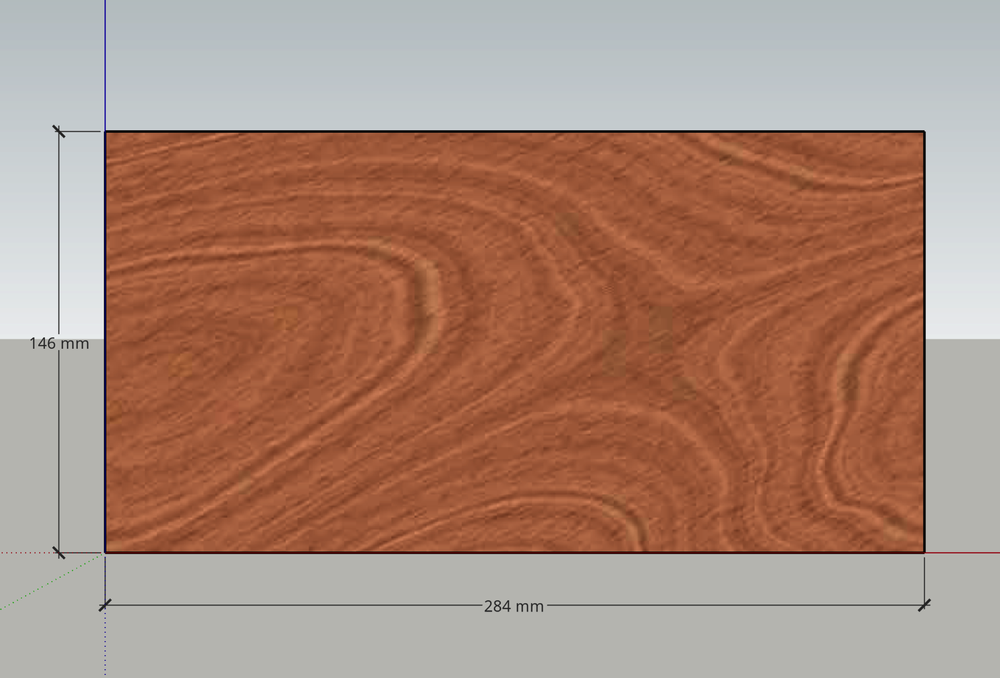

Drawer front 5, 284 x 305 mm for a nominal depth of 309 mm (with 4 mm clearance below).

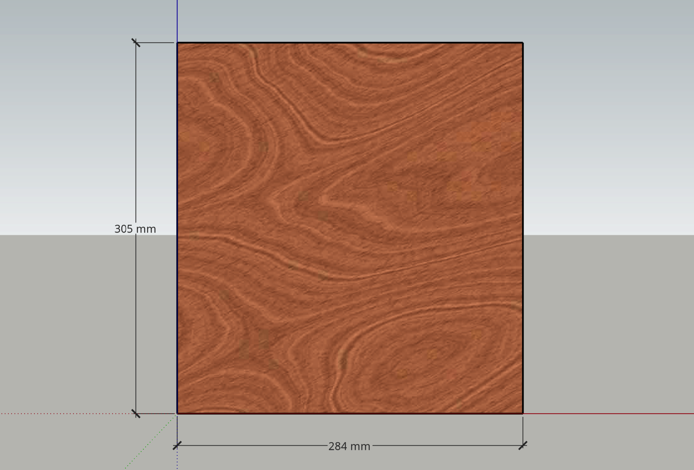

Provision for hardware not yet shown.

* Drawer 1, 350 mm long with the bottom set high for an effective depth of 50 mm.
* Drawer 2, 250 mm long with a rail across the top back instead of a back panel, so that there is a large opening for wiring.
* The rest of the drawers are entirely standard.

## Cupboard

Door 406 x 555 mm. Provision for hardware not yet shown.

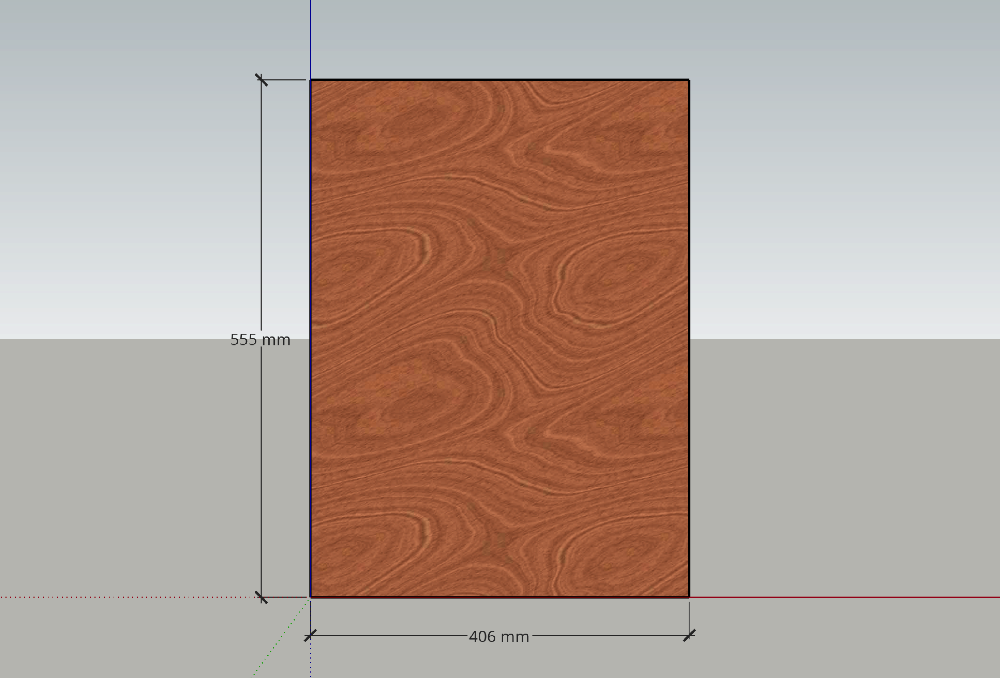

Floor 384 x 480 mm. Requires cutout at LB corner for passage of sink waste hose (drawn as 70 mm radius quarter circle).

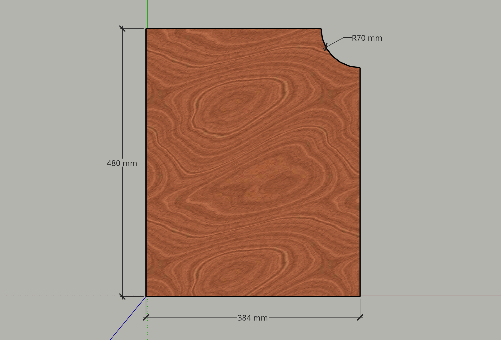

Shelf 410 x 500 mm. Requires hole under centre of sink bowl for passage of sink waste hose (drawn as 70 diameter but smaller would be preferable).

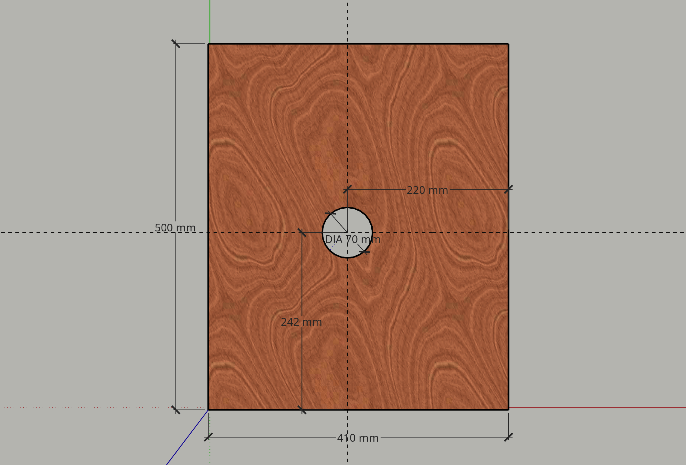

## Splash Back

1570 x 100 mm, with holes near centre for switchgear.

## Lid

Four sides of a 1600 x 530 x 112 mm box.
Pieces are…

* 1600 x 530 mm for top.
* 1600 x 100 mm for front.
* 2 of 518 x 100 mm for ends.

## End Shelf

400 x 530 mm. To attach to RH end when deployed.

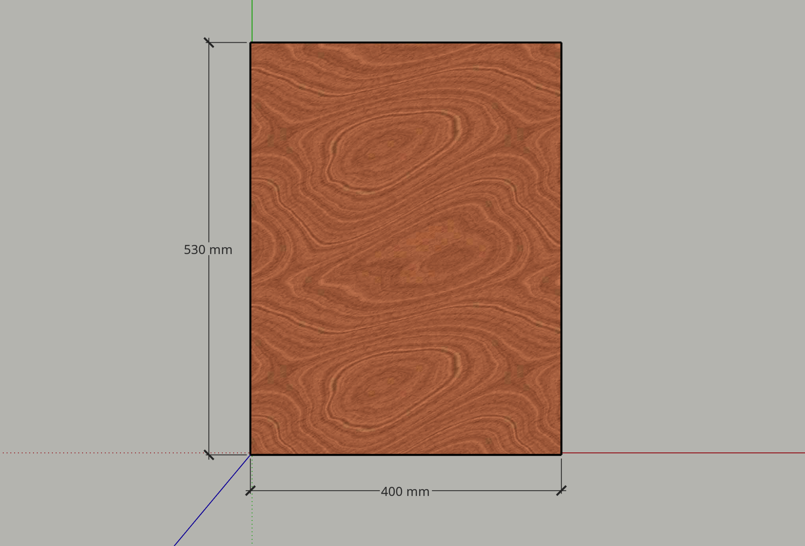
