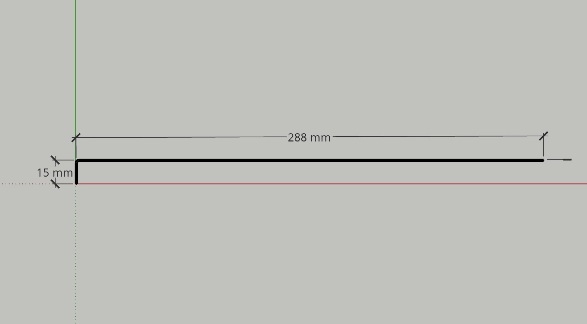
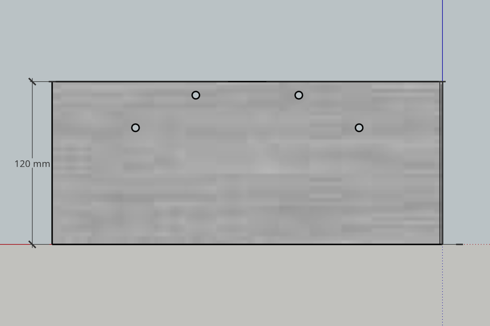
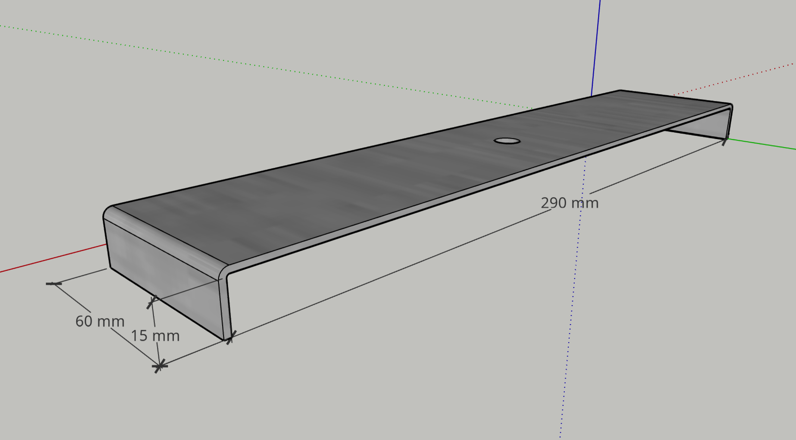
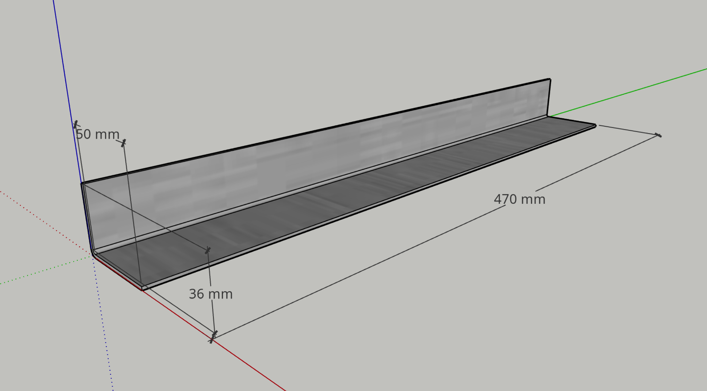
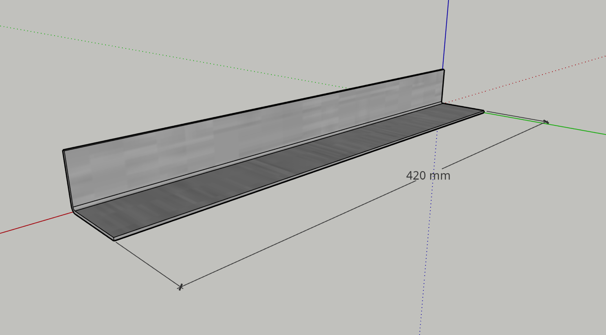
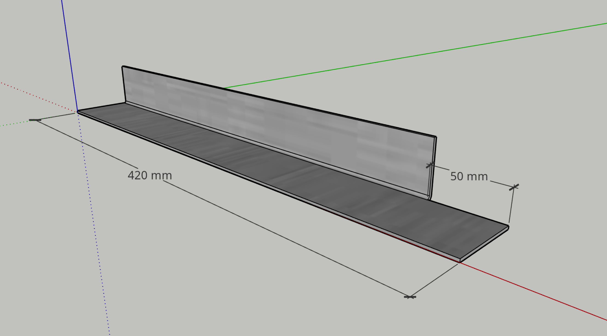
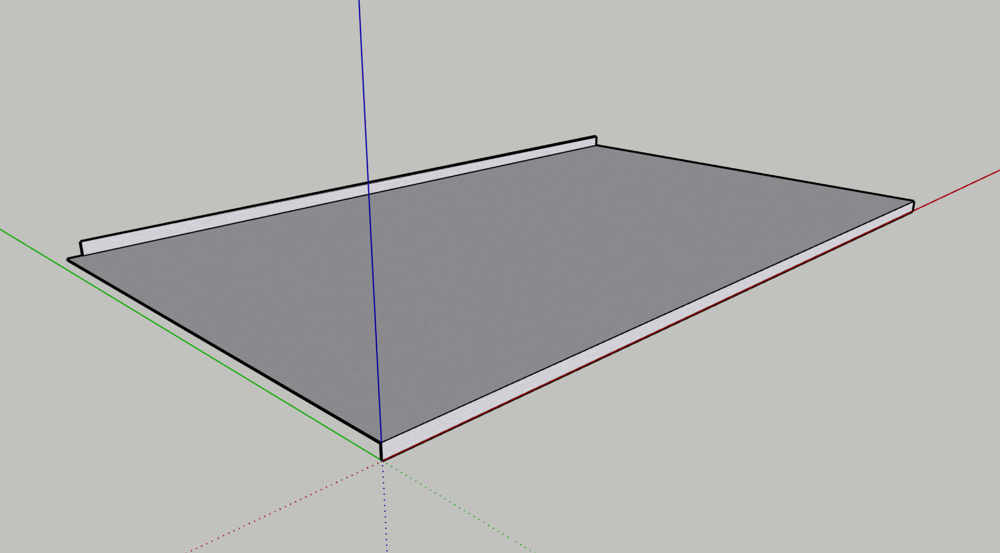
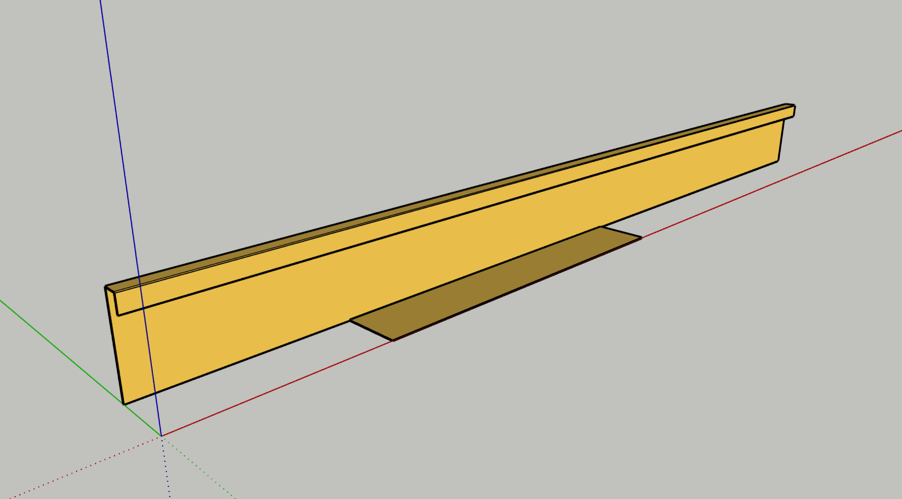
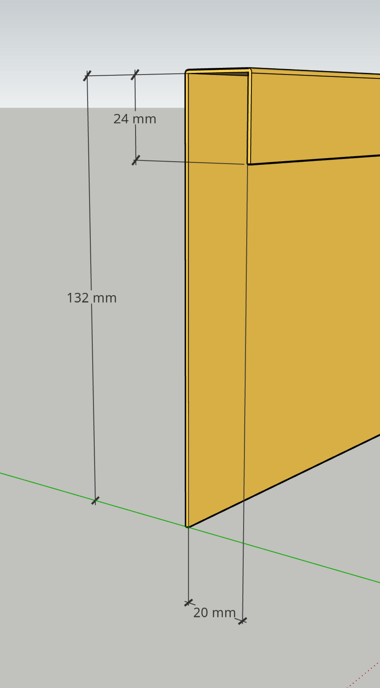

# Sheet Metal

1. [Number Plate Mount](#01)
2. [Battery Clamp](#02)
3. [Fridge Tray Rails](#03)
4. [Stainless Steel Top](#04)
5. [Splash Back Cover](#05)

--

##  Number Plate Mount

* To be attached to the back frame.
* Drawn as 1 mm sheet metal.

##  Battery Clamp

* Drawn as 2 mm sheet metal.

##  Fridge Tray Rails

* Drawn as 2 mm sheet metal.

Side rails.

Front rail.

Back rail (same as front with cutout for access to pilot light hole).

##  Stainless Steel Top

* To complement the sink in making a full stainless steel surface for the benchtop.
* Should have holes (not yet drawn) for stove attachment.
* Drawn as 1 mm, but should match the thickness of sink steel.

##  Splash Back Cover

* A cover for the top & rear of splash back.
* Has a return section to enclose pipes & wiring above fridge.
* Dimensions shown are *inside* the folds.
* Drawn as 1 mm, but should be less.

