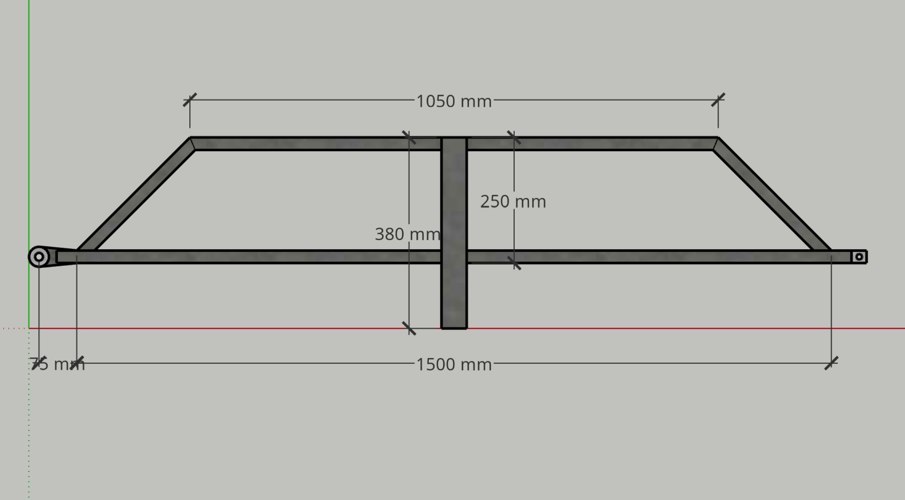

# Undercarriage

1. [Overview](#01)
2. [Base](#02)
3. [Front & Back Frames](#03)
4. [Energy Subframe](#04)
5. [Assembly](#05)

--

Made principally from…

* 25x50 mm RHS
* 50x50 mm RHS

**NOTE:** While researching I have seen "receiver" used for the towbar mounting socket on the vehicle, & "shank tube" for the part that plugs into the receiver. I use the same terms here.

##  Overview

The design intention is for the bottom front rail of the box frame to be positioned directly above the front cross member of the base. 

##  Base

* The base mounts to the vehicle with the central tube serving as shank tube & going into the receiver.
* The length of the shank tube is drawn to go the full 130 mm depth of the receiver on my vehicle. Making it a few mm shorter may be desirable.
* Hole to suit 5/8" hitch pin needs to be positioned to suit the receiver on my vehicle & is not drawn.
* 

<!--

## Pivot

-->